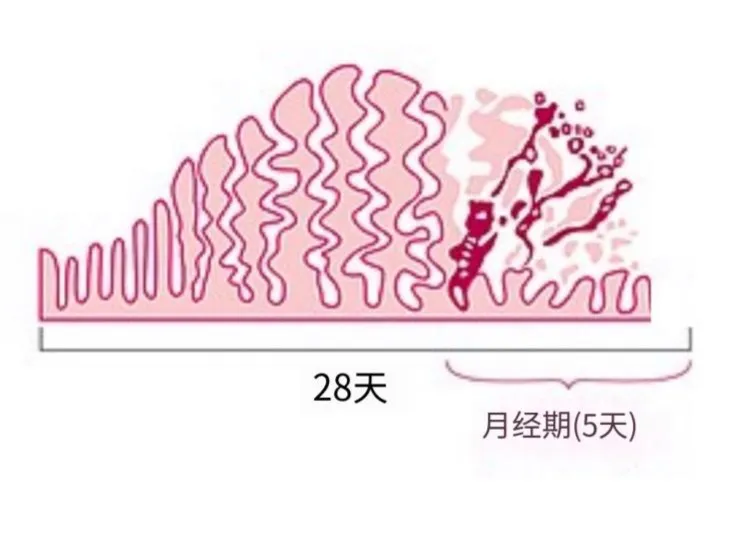

# 月经基础知识

## 定义

育龄妇女卵巢的卵泡生长、排卵和黄体的形成及伴随雌、孕激素分泌具有明显的周期性特征，由此引发的子宫内膜的周期性剥脱、出血的现象称为月经（Menstruation）[^1]。月经的出现是女性正常的生理现象，是生殖功能成熟的重要标志，月经出血通常持续2～7天。一般情况下，月经在更年期后停止，通常发生在45～55岁之间。不来月经的女性包括：绝经后女性、孕妇以及发生闭经的女性。在怀孕期间和分娩后的一段时间内，不会发生月经。母乳喂养时产后闭经的平均时间较长，这被称为哺乳期闭经。

## 月经周期

自青春期开始，子宫内膜（宫颈除外）在卵巢分泌的激素作用下出现周期性变化，即每隔28天左右发生一次内膜剥脱、出血、修复和增生，称为月经周期。每个月经周期是从月经第一天起至下次月经来潮前一天止，可分为月经期、增生期和分泌期三个时期[^2]。

·**增生期**：指月经周期的第5-14天，此间卵巢内有一些次级卵泡开始生长，向成熟卵泡发育，并分泌雌激素，故又称卵泡期。雌激素使子宫内膜增生增厚，子宫腺增多增长并变弯曲，子宫螺旋动脉更加伸长和弯曲。至月经周期第14天时，卵巢内通常有一个卵泡发育成熟并排卵，子宫内膜随之转入分泌期。

·**分泌期**：指月经周期的第15-28天。此时黄体形成，故又称黄体期。在黄体分泌的孕激素和雌激素作用下，子宫内膜继续增生变厚，子宫腺进一步变长、弯曲、腺腔扩大，腺腔内充满粘稠液体。螺旋动脉继续增长变得更弯曲并伸入内膜浅层。如未妊娠，内膜功能层将脱落，转入月经期。

·**月经期**：指月经周期的1-4天。此期由于卵巢月经黄体退化。雌激素和孕激素骤然下降，引起子宫内膜功能层的螺旋动脉持续性收缩，使内膜缺血，子宫腺分泌停止，组织液减少，从而功能层发生萎缩坏死。继而螺旋动脉又突然短暂扩张，致使功能层的血管破裂，血液流出并积聚在内膜浅部，最后和坏死的内膜一起剥落并经阴道排出，此即月经。在月经期结束之前，内膜基底层残留的子宫腺上皮开始迅速增生，并向子宫腔表面推移，使子宫内膜上皮得到修复。待月经期结束，其他组织也开始增生而转入增生期。

*图1：子宫内膜在月经周期中的建立和分解*

## 月经成分

月经呈暗红色，颜色比静脉血稍深。经血中约有一半是血液，该血液包含钠、钙、磷酸盐、铁和氯化物，具体含量存在个体差异。除血液外，月经中还包括宫颈黏液、阴道分泌物和子宫内膜组织。月经中的阴道液主要贡献水、普通电解质和至少14种蛋白质，包括糖蛋白。由于月经血中含有前列腺素及来自子宫内膜的大量纤维蛋白溶酶，并且纤维蛋白溶酶具有溶解纤维蛋白的作用，故月经血不凝固，在出血量多或速度快的情况下可出现血凝块[^3]。

## 月经初潮

### 定义

月经第一次来潮称月经初潮（menarche），初潮是女性进入青春期的重要标志。月经初潮通常始于12～15岁之间[^3]，11-16岁初潮也均属于正常现象 ，若16岁月经尚未来潮则应引起重视。

### 生理意义

月经来潮提示卵巢产生的雌激素足以使子宫内膜增殖，雌激素达到一定水平且有明显波动时，引起子宫内膜脱落即出现月经，但由于此时中枢对雌激素的正反馈机制尚未成熟，即使卵泡发育成熟也不能排卵，故月经周期常不规律，经5～7年建立规律的周期性排卵后，月经才逐渐正常[3]。

## 月经异常

月经失调（Menstrual disorder）是与一个人的月经周期有关的任何异常状况。有许多不同类型，体征和症状也不同的月经失调，包括月经期间疼痛，大出血，或没有月经等。
月经异常的类型包括：

● **经前紊乱**：主要包括经前期综合征（PMS）及经前期烦躁障碍（PMDD）

  ○ 经前期综合征：经前期综合征是一种是复发性黄体期紊乱，其特征是易受刺激、焦虑、情绪不稳定、抑郁、水肿、乳房痛和头痛，在月经前5天发生，通常在月经开始后数小时消失。

  ○ 经前期烦躁障碍：是一种严重的经前综合症，在月经周期的后半期发生，月经开始或开始后不久消失。患者有明显的抑郁，也有焦虑、易怒和情绪不稳等现象。

● **月经周期长度紊乱**：包含月经频发或稀发等。

● **月经流量紊乱**：月经过多或过少等。

● **排卵期紊乱**：排卵很少或不排卵（通常定义为周期大于35天或一年小于8个周期），表现为月经不规律，即月经间隔、持续时间或出血变得不可预测。无排卵可能引发月经停止（继发性闭经）或出血过多（子宫功能异常）。

● **其他月经失调**：如痛经等。

## 绝经

由于卵巢内卵泡自然耗竭或剩余的卵泡对垂体促性腺激素丧失反应，导致卵巢功能衰竭月经永久性停止即绝经（menopause）。我国妇女平均绝经年龄为49.5岁，80%在44～54岁之间[3]。妇女绝经的年龄与遗传因素有关，但也受到环境因素的影响，吸烟、环境、雌激素、感染、盆腔肿瘤等都有可能导致卵泡池的耗竭而提前绝经。一般40岁以前出现的绝经即为卵巢早衰。

[^1]:[王庭槐,生理学[M].9版.北京:人民卫生出版社,2018.](https://book.douban.com/subject/30481974/)
[^2]:[李继承，曾园山，组织学与胚胎学[M].9版.北京:人民卫生出版社,2019.](https://book.douban.com/subject/30812146/)
[^3]:[谢幸,孔北华,段涛. 妇产科学.9版[M]. 北京:人民卫生出版社, 2018.](https://baike.baidu.com/item/%E5%A6%87%E4%BA%A7%E7%A7%91%E5%AD%A6/61534647)