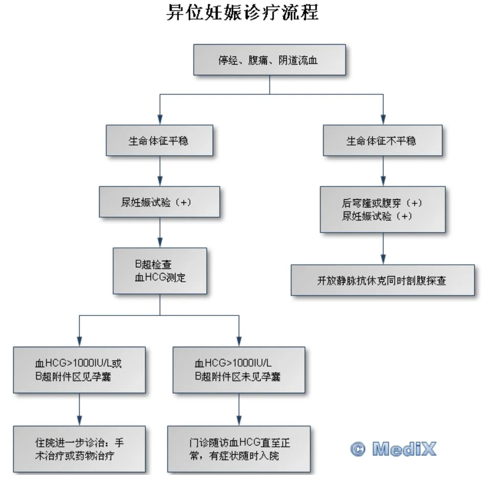

# 异位妊娠

## 定义

异位妊娠(EP)，也称为宫外孕，是指受精卵在子宫腔以外的位置着床 。正常妊娠时，受精卵应在输卵管内与精子结合，然后移动到子宫腔内着床。但由于某些原因，受精卵未能到达子宫腔，而在其他位置着床，由此产生异位妊娠。[^1]异位妊娠破裂是妊娠早期孕产妇死亡的主要原因，占所有妊娠相关死亡9%-14%，发生率为5%-10%。[^2]

## 分类（按发生部位）

**输卵管妊娠：**

**壶腹部**：约占80%，是输卵管妊娠最常见的部位

**峡部**：约占12%，峡部妊娠容易发生破裂

**伞端**：约占5%

**间质部**：约占2%，是输卵管穿过子宫壁的部分，此处妊娠破裂时可能导致大出血

**卵巢妊娠**：受精卵直接在卵巢表面着床，非常罕见

**腹腔妊娠**：受精卵种植在腹膜或其他腹腔器官上，极其罕见

**宫颈妊娠**：受精卵着床在宫颈管内，也很少见

*图1：异位妊娠发生部位及概率*[^3]

## 病因

### 盆腔炎性疾病 (PID)

是导致输卵管妊娠的最常见原因。炎症会损伤输卵管，可使输卵管粘膜皱襞粘连，导致管腔狭窄，粘膜破坏，上皮纤毛缺失，输卵管周围粘连，管形扭曲，以上情况影响孕卵在输卵管的正常运行和通过。

### 输卵管手术史

如输卵管结扎或输卵管修复手术，可能增加异位妊娠的风险，输卵管绝育后复通术或输卵管成型术，亦可因疤痕使管腔狭窄、通畅不良而致病。

### 输卵管发育或功能异常

如输卵管过长、肌层发育不良、粘膜纤毛缺如、双管输卵管、额外伞部等，均可成为输卵管妊娠的原因。

### 盆腔子宫内膜异位症

异位于盆腔的子宫内膜，对孕卵可能有趋化作用，促使其在宫腔外着床。

### 其他

● **辅助生殖技术 (ART)：**如体外受精 (IVF)，会增加异位妊娠的风险 ；

● **宫内节育器 (IUD) 使用失败**：IUD可以有效预防宫内妊娠，但如果IUD使用失败而发生妊娠，则异位妊娠的风险增加；

● **既往异位妊娠史**：有异位妊娠史的女性，再次发生异位妊娠的风险较高；

● **吸烟**：吸烟会影响输卵管的正常功能，增加异位妊娠的风险；

● **年龄**：高龄产妇发生异位妊娠的风险较高。

## 临床表现

异位妊娠的临床表现于着床部位、有无破裂、出血量密切相关。

**异位妊娠流产或破裂前**，症状和体征均不明显，除短期停经及妊娠表现外，有时出现一侧下腹胀痛。检查时输卵管正常或有肿大。

**异位妊娠流产或破裂后**，根据病情急缓一般分为急性和陈旧性两种类型，因输卵管妊娠最常见，以下临床表现以输卵管妊娠为例：

### 急性宫外孕

#### 症状

● **停经**：异位妊娠也属于妊娠，因此通常会有停经史。

● **腹痛**：为患者就诊时最主要症状。腹痛系由输卵管膨大、破裂及血液刺激腹膜等多种因素引起。破裂时患者突感一侧下腹撕裂样疼痛，常伴恶心呕吐。若血液局限于病变区，表现为下腹局部疼痛；血液积聚在子宫直肠陷凹时，肛门有坠胀感；出血量过多，血液由盆腔流至腹腔，疼痛即由下腹向全腹扩散；血液刺激膈肌时，可引起肩胛放射性疼痛。

● **阴道出血**：多为少量不规则出血，颜色可能为暗红色或咖啡色，淋漓不净

● **晕厥与休克**：由于腹腔内急性出血，可引起血容量减少及剧烈腹痛，轻者常有晕厥，重者出现休克，其严重程度与腹腔内出血速度和出血量成正比，即出血越多越急，症状出现越迅速越严重，但与阴道出血量不成正比。

#### 体征

**一般情况** 

● 腹腔内出血较多时，呈急性贫血外貌。大量出血时则有面色苍白、四肢湿冷、血压下降等休克症状。

● 体温一般正常，休克时略低，腹腔内血液吸收时可稍升高，但不超过38℃。

**腹部检查** 

● 下腹部有明显压痛、反跳痛，尤以患侧为剧；

● 出血较多时叩诊有移动性浊音；

● 历时较长后形成血凝块，下腹可触及肿块，反复出血使肿块增大变硬。

**盆腔检查**

● 阴道后穹窿饱满，触痛。宫颈有明显举痛，将宫颈轻轻上抬或向左右摇动时，即可引起剧烈疼痛；

● 子宫稍大而软，内出血多时，子宫有漂浮感；

● 子宫大小与停经月份基本符合，但子宫轮廓不相对称。

### 陈旧性宫外孕

● 指输卵管妊娠流产或破裂后病程长，经反复内出血病情渐趋稳定。

● 此时胚胎死亡，内出血停止，腹痛有所减轻，但所形成的血肿逐渐机化变硬，且与周围组织及器官粘连。

● 其临床特点为阴道不规则出血、阵发性腹痛、附件肿块及低热。低热为腹腔内血液吸收过程引起，如合并继发感染，则表现为高热。

## 诊断

### 病史询问

医生会详细询问您的月经史、孕产史、盆腔炎病史、手术史等，以评估异位妊娠的风险因素。

### 体格检查

包括腹部触诊和盆腔检查，以评估腹部压痛、反跳痛和附件区包块等体征。

### 实验室检查

**血清 hCG 检测**：人绒毛膜促性腺激素 (hCG) 是妊娠时产生的一种激素。通过检测血清 hCG 水平，可以判断是否妊娠。但异位妊娠时，hCG 水平可能低于正常妊娠。

### 影像学检查

**超声检查**：经阴道超声检查可以观察子宫腔内是否有妊娠囊，以及附件区的情况。如果在子宫腔外发现妊娠囊，则可以确诊为异位妊娠。

### 后穹隆穿刺
由于腹腔内血液最易积聚在子宫直肠陷凹，即使血量不多，也能经后穹隆窗磁吸出。抽出暗红色不凝血为阳性结果，说明有腹腔内积血存在

### 诊断性刮宫

如果超声检查结果不明确，可以进行诊断性刮宫，然后对刮出物进行病理检查，以判断是否存在绒毛。切片中如见到绒毛，可诊断为宫内妊娠，如仅见蜕膜而无绒毛，虽应考虑为异位妊娠，但不能确诊。

## 治疗

### 药物治疗

适用于病情稳定、无输卵管破裂、血 hCG 水平较低的患者。常用的药物是甲氨蝶呤 (MTX)，可以杀死滋养细胞，使异位妊娠停止生长。

### 手术治疗

● 适用于输卵管破裂、血 hCG 水平较高、药物治疗无效或不适用的患者。

● **输卵管切除术**：切除患侧输卵管。

● **保守性手术**：切开输卵管，取出妊娠物，保留输卵管。适用于有生育要求的患者。

### 期待疗法

● 仅适用于极少数情况，如hCG水平非常低且持续下降，无明显症状，且能密切随访的患者

● 期待疗法需要严密监测hCG水平变化，一旦出现症状加重或hCG水平上升，应立即采取其他治疗措施。

### 预后

异位妊娠是一种危急重症，如果未能及时诊断和治疗，可能导致输卵管破裂、腹腔内出血，甚至危及生命。经过及时治疗，大部分患者可以痊愈。但异位妊娠会增加再次发生异位妊娠的风险，也可能影响生育能力。

## 诊疗流程

*图2：异位妊娠诊疗流程图*

## 就医意见

### 紧急就医指征

如果出现以下任何症状，应立即就医：

● **剧烈腹痛**：特别是位于下腹部一侧的持续性疼痛。

● **阴道大量出血**：出血量明显多于平时月经量或伴有血块。

● **晕厥或休克**：由于腹腔内出血导致的血压下降和意识丧失。

● **肩部疼痛**：有时异位妊娠破裂会导致血液刺激膈肌，引起肩部放射性疼痛。

## 预防

● **积极治疗盆腔炎性疾病**：预防盆腔炎性疾病是预防异位妊娠的重要措施。

● **避免不必要的输卵管手术**：如无必要，尽量避免输卵管手术。

● **戒烟**：吸烟会增加异位妊娠的风险，因此戒烟有助于预防异位妊娠。

● **合理选择避孕方式**：选择合适的避孕方式，避免意外妊娠。

##引用

[^1]:[An Update and Review of Nontubal Ectopic Pregnancy Management.](https://pubmed.ncbi.nlm.nih.gov/37387695/)

[^2]:[Overview of Ectopic Pregnancy Diagnosis, Management, and Innovation. ](https://pmc.ncbi.nlm.nih.gov/articles/PMC10071153/)

[^3]:[Successful Management of an Advanced Interstitial Ectopic Pregnancy in a Resource-Limited Setting: A Case Report.](https://pmc.ncbi.nlm.nih.gov/articles/PMC10953172/)