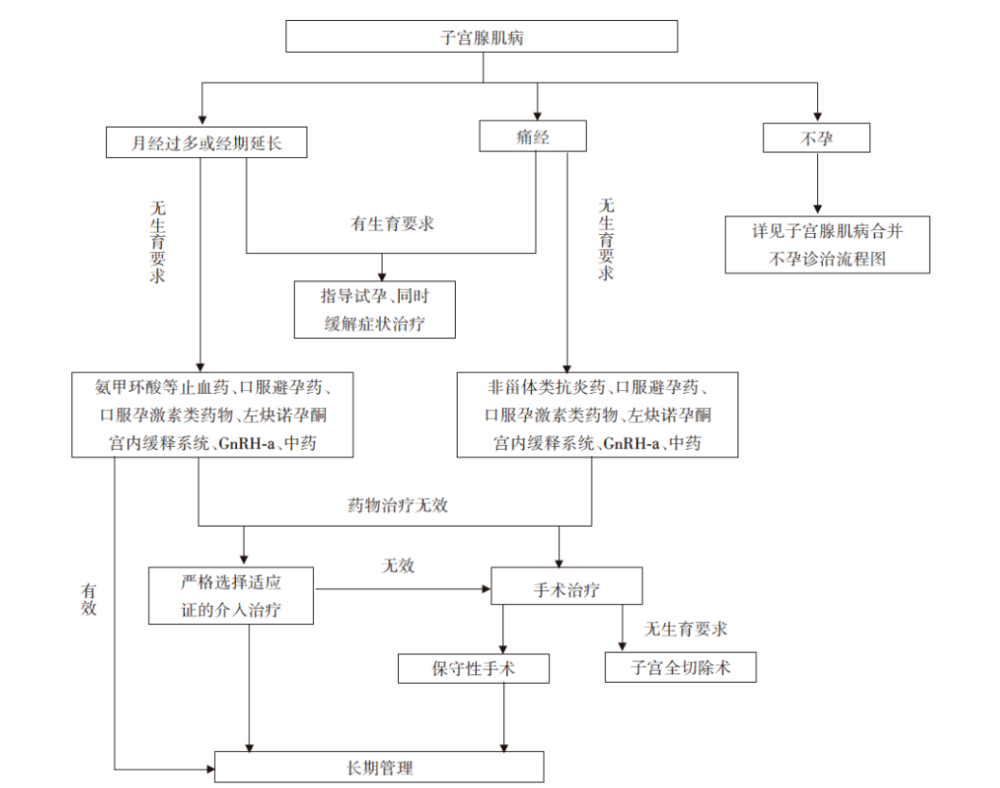

# 子宫腺肌病

## 定义

子宫腺肌病（简称腺肌病）是指子宫肌层内出现子宫内膜间质和腺体，在激素的影响下发生肌纤维结缔组织增生、出血，形成的局限性或弥漫性病变，也可在局灶形成子宫腺肌瘤病灶[^1]。多发生于育龄期经产妇，约15%同时合并内异症，约半数合并子宫肌瘤。

## 分类

根据2020年子宫腺肌病诊治专家共识[^2]，子宫腺肌病目前可按影响学表现分为弥漫性子宫腺肌病、局灶性子宫腺肌病（包括子宫囊性腺肌病和子宫腺肌瘤）及特殊类型（包括子宫内膜腺肌瘤样息肉及APA）。

## 病因

### 子宫损伤[^3]

如分娩、剖宫产、人工流产等可能破坏子宫内膜与肌层之间的屏障，导致内膜侵入肌层。

### 激素水平[^4]

雌激素可能促进子宫内膜异位生长，导致腺肌症的发生和发展。

### 遗传因素

研究表明，子宫腺肌症可能具有一定的遗传倾向。

### 炎症刺激

子宫腺肌病病灶中高表达炎症因子及神经源性介质即神经生长调节因子，两者相互作用，共同参与本病的发生和进展。

## 临床表现

### 症状

1.**痛经**：进行性加重的痛经是子宫腺肌症最典型的症状之一 。疼痛通常在月经前开始，月经期间加重，月经结束后逐渐缓解。

2. **月经量增多**：子宫腺肌症患者常出现月经量增多、经期延长，甚至导致贫血。

3. **不孕与流产**：子宫腺肌症可能影响受精卵着床和胚胎发育，导致不孕或流产。

4. **性交疼痛**：部分患者在性生活时可能感到疼痛。

5. **其他症状**：子宫增大可压迫邻近器官引起相关的临床症状，如压迫膀胱可引起尿路症状，如压迫肠管可引起肠刺激症状。长期疼痛以及不孕引起的精神心理相关的躯体障碍等

### 体征

妇科检查时，医生可能发现子宫增大，质地变硬，有压痛。但体征的特异性不强，需要结合其他检查进行诊断。

## 诊断

### 详细询问病史

妊娠及分娩史，宫腔操作史包括人工流产、诊刮、宫腔镜手术等，子宫手术史（如子宫肌瘤剔除术等）；

生殖道畸形导致生殖道梗阻的病史；

子宫腺肌病或子宫内膜异位症家族史；

其他疾病史，如高催乳素血症等。

### 临床表现

①进行性加重的痛经；②月经过多和(或)经期延长；③不孕；④妇科检查，常可及子宫增大，呈球形，或有局限性结节隆起，质硬且有压痛，经期压痛更为明显。子宫常为后位，活动度差。如患者具有典型的临床表现，可以临床诊断。

### 影像学检查

● **超声检查**：是诊断子宫腺肌症常用的方法，可以显示子宫增大、肌层增厚、内膜回声不均匀等特征性表现；

● **磁共振成像（MRI）**：MRI可以提供更清晰的图像，有助于确诊子宫腺肌症，并与其他疾病进行鉴别诊断。

### 实验室检查

如血清CA125检测，子宫腺肌症患者的CA125水平可能升高。

## 治疗

### 药物治疗

1. **非甾体类抗炎药（NSAID）**：

主要用于缓解子宫腺肌病的疼痛，以及减少月经量。副作用：主要为胃肠道反应，偶有肝肾功能异常。长期应用要警惕胃溃疡的可能。

2. **口服避孕药**：

主要用于缓解子宫腺肌病的疼痛，以及减少月经量。副作用：较少，偶有消化道症状或肝功能异常。40岁以上或有高危因素（如糖尿病、高血压、血栓史及吸烟）的患者，要警惕血栓栓塞的风险。

3. **口服孕激素类药物**：

可缓解子宫腺肌病的疼痛，以及减少月经量。副作用主要是子宫不规则出血，其他少见副作用包括体重增加、头痛、乳房胀痛等。

4. **促性腺激素释放激素激动剂(GnRH-a)**：

可以有效、快速缓解疼痛、治疗月经过多以及缩小子宫体积。副作用：主要是低雌激素血症引起的绝经相关症状如潮热、阴道干燥、性欲降低、失眠及抑郁等，长期应用则有骨质丢失的可能。

5. **左炔诺孕酮宫内缓释系统（LNG-IUS）**：

LNG-IUS放置方便，可以持续缓释左炔诺孕酮5年。临床应用表明，LNG-IUS对子宫腺肌病痛经、慢性盆腔痛和月经过多均有效。可作为月经过多的子宫腺肌病患者的首选治疗。副作用：月经模式的改变，包括淋漓出血及闭经；子宫腺肌病患者中LNG-IUS使用后的脱落和下移时有发生，使用前应让患者充分知情。

6. **中医中药**：

以缓解痛经为主。

7. **其他可用于减少出血的药物**：

云南白药、氨甲环酸。

### 手术治疗

1. **子宫全切除术**：

有症状的子宫腺肌病患者的根治性治疗是子宫全切除术，可以经腹腔镜、开腹或经阴道完成。

2. **保留子宫的手术**：

从缓解症状和促进生育考虑，子宫腺肌病患者应首先选择药物治疗；对于无法耐受长期药物治疗、药物治疗失败的生育年龄患者，可以选择保留子宫的手术，即保留生育功能的手术。

3. **子宫腺肌病的宫腔镜治疗**：

为子宫腺肌病的保守性手术治疗。宫腔镜不推荐作为子宫腺肌病的一线治疗方案，仅在部分局灶性及浅层弥漫性子宫腺肌病中有一定的治疗作用。

### 介入治疗

1. **子宫动脉栓塞术（uterine arterial embolization, UAE）**：

UAE属于血管介入治疗的一种，通过栓塞双侧子宫动脉，导致异位内膜缺血、缺氧，发生坏死、吸收，从而达到减小病灶及子宫体积、减轻临床症状的治疗作用。

2. **高强度聚焦超声（high intensity focused ultrasound，HIFU）**：

HIFU是一种新型的无创治疗方法，应用超声波良好的穿透性、方向性和可聚焦性的特点，将超声波自体外聚焦于体内靶区域，使组织温度骤升至65 ℃以上产生热效应，导致病变局部组织细胞发生凝固性坏死，同时产生空化效应及机械效应，以达到不损伤周围组织但破坏病灶的效果。

3. **微波（射频）消融**：

微波或射频消融也是热消融治疗方法，在子宫腺肌病的临床应用较少。

## 诊疗流程

*图1：子宫腺肌病诊疗流程*

## 就医建议

1. **定期体检**：建议育龄期女性定期进行妇科检查，以便及早发现子宫腺肌症。

2. **及时就医**：如出现痛经、月经量增多等症状，应及时就医，明确诊断。

3. **咨询医生**：对于已确诊子宫腺肌症的患者，应咨询医生，根据自身情况选择合适的治疗方案。

4. **生育指导**：计划怀孕的女性，如患有子宫腺肌症，应咨询医生是否需要进行治疗，以及治疗方式对生育的影响。

---

**编写者：** 颜妞  **上传者：** 张梓润

## 参考文献

[^1]:[子宫腺肌病的诊断与治疗进展](https://kns.cnki.net/kcms2/article/abstract?v=QUtgg5W7F1_AuvWgUq7e_8bXPXgopPcgPcmE90FgK9A4vjQsrRUecbrM1raLydvpS-QHMyxLhMOslEx-DQWLrSaepIb6WBCEUZX8roeZ0yxAgf41YXjnEHcoh-KjKQc9YkZxTApvB0C2vGuAKZuIz6gcEEcEB9ZvJPhUgTJ0-RlIUuHJ7zQV8t0MSL7m7BVM&uniplatform=NZKPT&language=CHS)

[^2]:[子宫腺肌病诊治中国专家共识[J].中华妇产科杂志](https://seleguide.yiigle.com/uploads/guide_html/%E5%AD%90%E5%AE%AB%E8%85%BA%E8%82%8C%E7%97%85%E8%AF%8A%E6%B2%BB%E4%B8%AD%E5%9B%BD%E4%B8%93%E5%AE%B6%E5%85%B1%E8%AF%86.html)

[^3]:[Epidemiological study of uterine fibroids: our experience from urban Maharashtra](https://www.researchgate.net/publication/362300670_Epidemiological_study_of_uterine_fibroids_our_experience_from_urban_Maharashtra)

[^4]:[Current medical treatment of uterine fibroids](https://pmc.ncbi.nlm.nih.gov/articles/PMC5854898/)