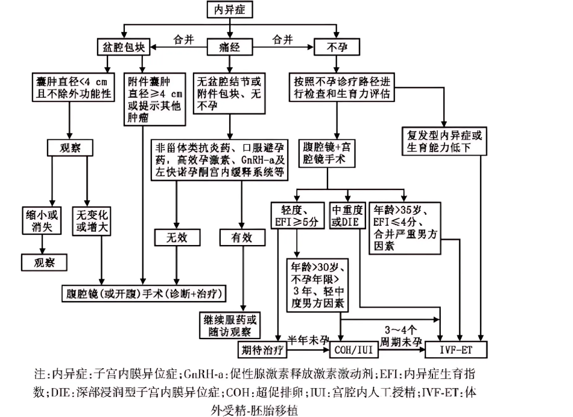

<!-- 示例 -->
# **子宫内膜异位症** 

## **定义** [^4]

子宫内膜异位症（内异症）是指子宫内膜组织（腺体和间质）在子宫腔被覆内膜及子宫以外的部位出现、生长、浸润，反复出血，继而引发疼痛、不孕及结节或包块等。内异症是生育年龄妇女的多发病、常见病。内异症病变广泛、形态多样、极具侵袭性和复发性，具有性激素依赖的特点。

WHO最新数据显示，子宫内膜异位症影响到全球大约10%（1.9亿）的育龄妇女和女童。[^5]综合文献报道，约10%的生育年龄妇女患有内异症，即全球约有1.76亿妇女为内异症患者；20%~50% 的不孕症妇女合并内异症,71%~87%的慢性盆腔疼痛妇女患有内异症。内异症是导致痛经、不孕症和慢性盆腔痛的主要原因之一，不仅对患者的生命质量产生负面影响，还对社会卫生资源造成重大负担 。

### **内在性子宫内膜异位症** 

子宫内膜组织在子宫肌层内生长，又称为子宫腺肌病。

### **外在性子宫内膜异位症** 

子宫内膜侵犯子宫肌层以外的组织，以卵巢最为多见，称为[巧克力囊肿](link)。此外子宫骶韧带、子宫下段后壁浆膜层以及子宫直肠陷凹、乙状结肠的盆腔腹膜、阴道直肠隔等处也较为常见。

请参考词条[内异症自我管理指南](../self-care-guide.md)

## **病因** 

子宫内膜异位症的确切病因尚不清楚，但有几种理论被提出，其中经血逆流学说为如今的主流学说：

### **经血逆流种植学说** 

月经期脱落的子宫内膜碎屑随经血逆流，经输卵管进入腹腔，种植于卵巢表面或盆腔其他部位。

内异症形成“三步曲”:粘附、侵袭、血管形成,可将其称为“3A”程序。[^1]

经量多于正常的育龄期妇女更容易发生经血内流。

### **体腔上皮化生学说** 

部分体腔上皮具有高度化生潜能，可以在内分泌化学物质的刺激下向子宫内膜上皮转化。[^2]

### **淋巴及静脉播散学说** 

子宫内膜碎屑可以进入淋巴或静脉循环，播散种植至远隔器官，如肺、胸膜等。

## **临床表现** 

### **症状** 

#### **疼痛** 

与月经周期有密切关系

[痛经](link)

主要表现为继发性与渐进性痛经。多于月经开始前1～2天出现，月经第1天最严重，以后逐渐减轻，可持续整个经期。疼痛部位多为下腹深部和腰骶部，有时可放射至会阴、肛门或大腿。[^3]

**其他部位疼痛** 

慢性盆腔痛、性交痛、排便痛和其他不同形式的疼痛。

### **月经异常** 

以经量增多或经期延长为主，可能与内膜增生或卵巢功能失调有关。

### **不孕** 

内异症所致不孕和流产的原因复杂、多样。包括盆腔炎症、粘连；不良卵泡、排卵障碍；输卵管的拾卵和受精卵的输送不良；胚胎质量低下、子宫内膜种植困难等。

## **体征** 

**主要为结节和包块** 

绝大多数内异症都有结节或者包块，甚至可以出现在身体的任何部位。

● 扪及子宫粘连的肿块、破裂时有腹膜刺激症

● 双和诊时发现子宫后倾固定

● 直肠子宫陷凹/宫骶韧带/子宫后壁下方扪及触痛性结节

● 一侧/双侧附件处触及囊实性包块，活动度差

● 阴道后穹隆触及痛性小结节

## **诊断** 

### **病史询问** 

详细的病史询问，包括家族史、既往史和妇科史诊断的重要组成部分。

● **家族史** ：询问是否存在子宫内膜异位症的一级亲属，因为遗传因素可能增加患病风险

● **既往史** ：关注可能增加子宫内膜异位症风险的早期生活因素，如早产、低出生体重、既往腹部手术史等

● **妇科史** ：重点关注初潮年龄、月经出血模式（如经量过多）、不良妊娠结局以及既往盆腔手术史等

● **妊娠史** ：是否怀孕或不孕

### **症状评估** 

症状可能包括经期相关疼痛、非周期性疼痛、性交困难、排便疼痛、排尿困难和胃肠道症状等

● 症状出现的时间以及严重程度

● 症状的出现月经周期是否有关

● 是否出现痛经，并且有逐渐加重的趋势

● 医生会通过问诊，让患者描述自己疼痛严重程度：0代表无痛，1～3代表轻微疼痛逐渐加重，4代表刚对睡眠带来影响的疼痛，5～6代表渴望药物治疗的疼痛，7代表疼痛影响入睡，8～10代表逐渐不能忍受的剧痛。由此，可获得症状的[视觉模拟评分（Visual Analogue Scale/Score，简称VAS）](link)，用于指导后续治疗方案的选择

● 是否有其他不适

### **体格检查** 

#### **双合诊/三合诊** 

在检查时，医生会用手触摸盆腔的异常区域。妇科检查摸到与子宫相连的囊性包块或盆腔内有结节，触痛明显，有助于疾病的初步诊断。

### **影像学检查** 

#### **B超** 

经阴道/肛门超声检查是诊断卵巢异位囊肿和直肠内异症的重要方法，可确定病灶的位置、大小和形状

#### **核磁共振MRI** 

#### **腹腔镜检查** 

可以直视病灶，通常不单独应用于诊断，往往同期做腹腔镜手术，去除疑似病变组织。

### **实验室检查** 

#### **血清CA125测定** 

● CA125水平升高更多见于重度内异症、盆腔有明显炎症反应、合并子宫内膜异位囊肿破裂或子宫腺肌病者。

● CA125在其他疾病如卵巢癌中也可以升高，由于其敏感性并不是很强，一般不作为独立诊断的依据。

● 可用于监测病情变化、评估疗效和预测复发。

#### **抗子宫内膜抗体** 

### **组织活检** 

## **治疗** 

**根本目的**  缩减和去除病灶，减轻和控制疼痛，治疗和促进生育，预防和减少复发

### **药物治疗** 

#### **非甾体抗炎药** 

● 主要机制： 抑制前列腺素的合成，阻止致痛物质的形成和释放。但不能延缓内异症的进展。  

●  用法：推荐与孕激素或COC联用；根据需要应用，间隔不少于6h。  

● 副作用：胃肠道反应，肝肾功能异常。 长期应用要警惕胃溃疡的可能。  

#### **复方口服避孕药COC**

● 主要机制：通过降低垂体促性腺激素水平，造成类似妊娠的人工闭经。

●  用法：连续或周期用药。  

● 副作用：恶心、呕吐、40岁以上或有高危因素（如糖尿病、高血压、血栓史及吸烟）的患者，要警惕血栓的风险  。

#### **孕激素**

● 主要机制：抑制垂体促性腺激素分泌，使子宫内膜蜕膜化形成假孕。

● 副作用：恶心、轻度抑郁、水钠潴留、阴道不规则流血。

#### **促性腺激素释放激素激动剂GnRH-a** 

● 主要机制：通过负反馈抑制垂体分泌促性腺激素，导致
卵巢激素水平下降，又称为药物性卵巢切除。

● 用法：依不同的制剂有皮下注射或肌内注 射，每28天1次，共用3~6个月或更长时间。

● 副作用：潮热、骨质丢失、阴道干燥、性欲减退。

#### **其他** 

孕激素拮抗剂、雄激素衍生物、中药

### **其他治疗** 

● 激素型宫内节育器：如**左炔错孕酮宫内节育系统（避孕环）** ：目的是缓慢释放孕激素，使子宫内膜萎缩，可明显减少月经血量、缓解痛经。适合近期无生育要求的患者。

● 阴道环

● 皮下埋植

● 针剂

● 贴片

### **手术治疗** 

#### **目的** 

切除病灶；恢复解剖；促进生育。  

#### **手术种类及选择原则** 

**1.保留生育功能手术：** 

● 适合于年龄较轻或需要保留生育功能者

● 保留子宫和至少部分卵巢组织

● 术后复发率高，约为40%

**2.保留卵巢功能手术：** 

● 切除病灶及子宫，保留至少部分卵巢组织

● 主要适合症状明显且无生育要求的45岁以下患者

● 复发率约为5%

**3.根治性手术：** 

● 切除所有病灶

● 适合年龄较大、无生育要求、症状重或者复发经保守性手术或药物治疗无效者

● 几乎不复发

## **诊疗流程[^4]** 

*图1：子宫内膜异位症的诊疗过程图*

## **就医建议** 

子宫内膜异位症对患者身体危害较大，因此如果出现以下情况，建议尽早到医院就诊：

● 痛经，且逐渐加重；

● 月经异常；

● 剧烈腹痛；

● 性交疼痛；

● 怀孕困难。

<!-- ### 常见症状统计（示例）

| 症状类型 | 发生率 | 严重程度 | 影响生活质量 |
|----------|--------|----------|-------------|
| 痛经 | 80-90% | 中-重度 | 显著影响 |
| 慢性盆腔痛 | 60-80% | 中-重度 | 严重影响 |
| 性交痛 | 40-60% | 中-重度 | 中等影响 |
| 不孕 | 30-50% | 重度 | 严重影响 |

## 相关词条（示例）
- [疼痛管理](../pain-management.md)
- [营养与生活方式建议](../nutrition-lifestyle.md)

### 跨文件夹链接示例

#### 链接到根目录下的文件
- [参与指南](../../how-to-participate.md.md) - 链接到docs根目录下的文件
- [首页](../../index.md) - 链接到docs根目录下的index.md

#### 链接到其他文件夹下的文件
- [生理学介绍](../Intro/physiology-intro.md) - 链接到Intro文件夹下的文件
- [月经周期详解](./menstrual-cycle.md) - 链接到同一文件夹下的文件

#### 链接到上级目录的其他文件夹
- [健康百科首页](../../index.md) - 链接到docs根目录
- [其他生理学内容](../Intro/) - 链接到Intro文件夹（会显示该文件夹的index页面）

隐藏内容 --> 

<!-- [^1]: [中国医师协会妇产科医师分会,中华医学会妇产科学分会子宫内膜异位症协作组.子宫内膜异位症诊治指南（第三版）[J]. 中华妇产科杂志, 2021, 56(12): 812-824. DOI: 10.3760/cma. j. cn112141-20211018-00603.](https://doi.org/10.3760/cma.j.cn112141-20211018-00603)
[^2]:  [WHO子宫内膜异位症全球报告](https://www.who.int/news-room/fact-sheets/detail/endometriosis) -->
[^1]:[郎景和.关于子宫内膜异位症的再认识及其意义[J].中国工程科学,2009,11(10):137-142.](https://www.engineering.org.cn/sscae/CN/Y2009/V11/I10/137#4)
[^2]:[BurneyRichard O., GiudiceLinda C.. Pathogenesis and Pathophysiology of Endometriosis. Fertility and Sterility, 98(3): 511--519, 2012. DOI: 10.1016/j.fertnstert.2012.06.029.](https://pubmed.ncbi.nlm.nih.gov/22819144/)
[^3]:[郎景和.对子宫内膜异位症认识的历史、现状与发展[J].中国实用妇科与产科杂志,2020,36(03):193-196.DOI:10.19538/j.fk2020030101.](http://dx.doi.org/10.19538/j.fk2020030101)
[^4]:[中国医师协会妇产科医师分会,中华医学会妇产科学分会子宫内膜异位症协作组.子宫内膜异位症诊治指南（第三版）[J]. 中华妇产科杂志, 2021, 56(12): 812-824. DOI: 10.3760/cma. j. cn112141-20211018-00603.](https://rs.yiigle.com/cmaid/1346124)
[^5]:[内异症自我管理指南](../self-care-guide.md)
