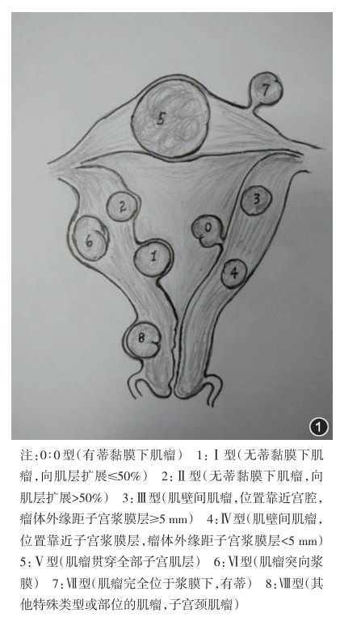
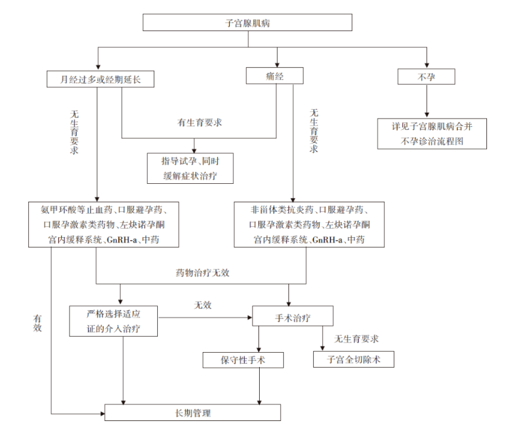

# 子宫肌瘤

## 定义

子宫肌瘤是子宫平滑肌组织增生而形成的良性肿瘤，是女性最常见的良性肿瘤。子宫肌瘤的发病率难以准确统计，估计育龄期妇女的患病率可达25%，根据尸体解剖统计的发病率可达50%以上。 [^1] 

## 分类

*图1：国际妇产科联盟（FIGO）子宫肌瘤9型分类方法示意图*

## 病因
 
### 高危因素  
 
 年龄>40岁、初潮年龄小、未生育、晚育、肥胖、多囊卵巢综合征、激素补充治疗、黑色人种及子宫肌瘤家族史等，这些因素均与子宫肌瘤的发病风险增加密切相关。  
 
### 遗传易感性学说  

研究表明，子宫肌瘤具有一定的遗传倾向[^2]。
  
  ● 子宫肌瘤患者的女儿患病风险大；
  
  ● 同卵双胞胎女性同时发生子宫肌瘤的概率远高于异卵双胞胎；

  ● 子宫肌瘤与种族密切相关，黑色人种多发；

  ● 40%～50%患者存在染色体结构异常。
 
### 性激素学说  

子宫肌瘤是性激素依赖性肿瘤，雌激素和孕激素在其发生发展中起重要作用。肌瘤在生育期生长迅速，而绝经后往往会萎缩[^3]。

### 干细胞突变学说  

分子生物学研究揭示，子宫肌瘤是由单克隆平滑肌细胞增殖形成，而单个肌瘤中的不同细胞均起源于单个母细胞，提示单个母细胞应具备全能干细胞的特性，子宫肌瘤可能是由单一干细胞的突变所致。  

## 临床表现

### 症状

许多子宫肌瘤患者没有明显症状，尤其是在肌瘤较小的情况下。但当肌瘤增大或位置特殊时，可能引起以下症状：

1. **月经改变**：**最常见**的症状是月经量增多、经期延长或不规则出血。长期月经过多可能导致贫血。

2. **盆腔疼痛**：肌瘤可能引起盆腔疼痛、下腹坠胀或腰骶部酸痛。

3. **压迫症状**：较大的肌瘤可能压迫膀胱、直肠等邻近器官，导致尿频、尿急、便秘等症状。

4. **不孕与流产**：黏膜下肌瘤或较大的肌壁间肌瘤可能影响受精卵着床或胚胎发育，导致不孕或流产。

### 体征

● 表现为子宫增大，呈球形或不规则，或与子宫相连的肿块；

● 与肌瘤大小、部位及数目有关：0型有蒂黏膜下肌瘤可从子宫颈口脱出至阴道。浆膜下肌瘤查体容易误诊为卵巢实性肿物。  

## 诊断

1. **妇科检查**：初步评估子宫的大小、形状和质地。

2. **超声检查**：是诊断子宫肌瘤最常用且有效的手段 。经腹或经阴道超声可以清晰显示肌瘤的大小、数量、位置及与周围器官的关系。

3. **磁共振成像（MRI）**：对于超声检查结果不明确或需要进一步评估肌瘤情况的患者，MRI可以提供更详细的信息 。MRI有助于鉴别肌瘤与其他盆腔肿块，并评估肌瘤的血供情况 。

4. **其他检查**：在某些情况下，医生可能会进行宫腔镜检查或诊断性刮宫，以排除子宫内膜病变。

## 治疗

### 期待治疗

● 适用于无症状或症状轻微、肌瘤较小且无明显增大趋势的患者；

● 定期复查，监测肌瘤的变化情况。

### 药物治疗

● 主要目的是缓解症状，控制肌瘤生长，为手术创造条件或作为围手术期辅助治疗。

● 药物治疗通常只能暂时控制症状，不能根治肌瘤。

● 常用药物包括：

**促性腺激素释放激素激动剂（GnRH-a）**：通过抑制卵巢功能，降低雌激素水平，使肌瘤缩小 。但长期使用可能引起骨质疏松等副作用，通常不建议长期使用。

**选择性孕激素受体调节剂（SPRMs）**：如米非司酮、醋酸乌利司他等，可以抑制肌瘤生长，减少出血 。

**复方口服避孕药**：可用于缓解月经过多等症状 。

**Relugolix 联合疗法**: Relugolix 联合疗法（40 毫克瑞卢戈利司、1 毫克雌二醇、0.5 毫克醋酸诺雷替尼）能显著改善与子宫肌瘤相关的月经过多出血[^4]。

### 手术治疗

● 适用于症状明显、药物治疗无效、肌瘤较大或怀疑恶变的患者。

● **子宫肌瘤切除术**：保留子宫，切除肌瘤，适用于有生育要求的患者。手术方式包括开腹、腹腔镜和宫腔镜。

● **子宫切除术**：切除整个子宫，适用于无生育要求或肌瘤症状严重、保守治疗无效的患者。手术方式包括开腹、腹腔镜和阴式子宫切除术。

● **子宫动脉栓塞术（UAE）**：通过介入手段阻断子宫动脉血供，使肌瘤缺血坏死，从而缩小肌瘤，缓解症状。

● **射频消融术**：利用射频能量破坏肌瘤组织，达到治疗目的。

● **磁波聚焦超声（HIFU）**：利用高强度聚焦超声波，将能量聚集于肌瘤，使其发生凝固性坏死。

## 诊疗流程

*图2：诊疗流程*

## 就医建议

**定期体检**：建议育龄期女性定期进行妇科检查，以便及早发现子宫肌瘤。

**及时就医**：如出现月经异常（如月经量增多、经期延长、不规则出血）、盆腔疼痛、腹部包块等症状，应及时就医，明确诊断。

**咨询医生**：对于已确诊子宫肌瘤的患者，应咨询医生，根据自身情况选择合适的治疗方案。

**生育指导**：计划怀孕的女性，如患有子宫肌瘤，应咨询医生是否需要进行治疗，以及治疗方式对生育的影响。

**关注心理健康**:社会和家庭支持对改善健康结果至关重要。

## 引用

[^1]:[子宫肌瘤的诊治中国专家共识专家组.子宫肌瘤的诊治中国专家共识[J].中华妇产科杂志](https://cmab.yiigle.com/uploads/guide_html/%E5%AD%90%E5%AE%AB%E8%82%8C%E7%98%A4%E7%9A%84%E8%AF%8A%E6%B2%BB%E4%B8%AD%E5%9B%BD%E4%B8%93%E5%AE%B6%E5%85%B1%E8%AF%86.html)

[^2]:[Current medical treatment of uterine fibroids](https://pmc.ncbi.nlm.nih.gov/articles/PMC5854898/)

[^3]:[Heavy menstrual bleeding, iron deficiency, and iron deficiency anemia: Framing the issue](https://obgyn.onlinelibrary.wiley.com/doi/epdf/10.1002/ijgo.14943)

